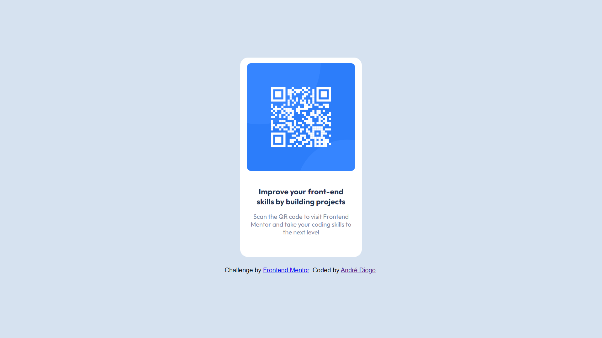

# Frontend Mentor - QR code component solution

## Overview
   Solution using CSS with the mobile-first technique

### Screenshot

### Links

- Solution URL: [https://github.com/KingAndre13/frontend-mentor/blob/master/qr-code/index.html]
- Live Site URL: [https://kingandre13.github.io/frontend-mentor/qr-code/]

### Built with

- Semantic HTML5 markup
- CSS custom properties
- Mobile-first workflow

### My process and What I learned
  Well, I think what I learned from the project is that no matter how simple it may be, it taught me to be confident. I came here to practice what I learned in the courses I take and this challenge showed me that I am capable of building beautiful designs like the one in this project. I started out a little lost at the beginning, but I managed to develop what I wanted.

### Continued development
   I want to develop better in web layouts.

## Author

- Frontend Mentor - [@kingandre13](https://www.frontendmentor.io/profile/kingandre13)

## Acknowledgments

Brazilian Teacher: Gustavo Guanabara[https://www.youtube.com/cursoemvideo]
